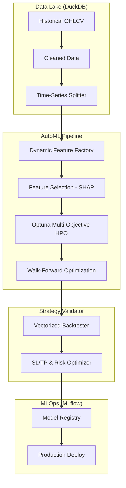

# AUTO ML Research & Training System (ART)
**Architecture Design & Implementation Blueprint**
**Version:** 1.0.0
**Author:** Senior Quant & MLOps Architect

---

## 1. Arsitektur Sistem (High-Level)
Sistem ini menggunakan arsitektur **Decoupled Research-to-Production**. Komponen riset berjalan di lingkungan *heavy-compute*, sementara model yang terpilih dikirim ke *low-latency executor*.



---

## 2. Struktur Folder Proyek
```text
/ml_research                # Root folder AutoML
├── /data
│   ├── store.duckdb        # Database riset utama (Time-series optimized)
│   └── /parquet            # Cache data fitur untuk penghematan RAM
├── /features
│   ├── generators.py       # Logika indikator dinamis (TA-Lib wrappers)
│   ├── pipeline.py         # Sklearn Pipelines (Scaling/Normalizer)
│   └── selectors.py        # SHAP & Permutation Importance logic
├── /models
│   ├── trainer.py          # Wrapper XGBoost, LightGBM, CatBoost, TFT
│   └── tuner.py            # Optuna objective functions
├── /backtest
│   ├── engine.py           # Vectorized engine (Numba/NumPy optimized)
│   └── metrics.py          # Quant metrics (Sharpe, Sortino, Expectancy)
├── /registry
│   └── mlflow_store/       # Local MLflow experiment tracking
└── main_research.py        # Entry point pipeline riset otomatis
```

---

## 3. Skema Database (DuckDB)
DuckDB dipilih karena performa agregasi OLAP yang superior untuk data time-series lokal dibandingkan PostgreSQL.

### Table: `market_data`
| Column | Type | Description |
| :--- | :--- | :--- |
| timestamp | TIMESTAMP | Primary Key (UTC) |
| symbol | VARCHAR | e.g., 'XAUUSDm' |
| open/high/low/close | DOUBLE | Price data |
| volume | BIGINT | Tick volume |

### Table: `experiments`
| Column | Type | Description |
| :--- | :--- | :--- |
| experiment_id | UUID | Unique ID |
| model_name | VARCHAR | Tag/Name |
| composite_score | DOUBLE | 40% Profit, 25% PF, 15% Sharpe, 10% WR, 10% DD |
| params_json | JSON | Hyperparameters & Feature configs |
| artifact_path | VARCHAR | Path to .onnx or .pkl |

---

## 4. ML Pipeline Workflow

### A. Dynamic Feature Factory
Sistem tidak menggunakan parameter indikator statis.
- **Trend:** Multi-window EMA (5, 13, 21, 50, 200).
- **Momentum:** RSI & Stochastic dengan optimasi window (7 s/d 28).
- **Volatility Scaling:** Semua fitur di-normalisasi menggunakan **Z-Score** atau **ATR-Ratio** untuk menangani *Non-Stationarity*.

### B. Feature Selection (SHAP)
Setelah generate 200+ fitur, gunakan **SHAP (SHapley Additive exPlanations)** untuk:
1. Menghitung kontribusi tiap fitur terhadap profitabilitas (bukan cuma akurasi).
2. Membuang fitur yang memiliki redundansi tinggi (korelasi antar fitur).

---

## 5. Walk-Forward Validation (WFO)
Wajib menghindari `train_test_split` acak. Menggunakan **Rolling Window Validation**:
- **Train Window:** 6 bulan (Learning patterns).
- **Validation Window:** 1 bulan (Hyperparameter tuning via Optuna).
- **OOS (Out-of-Sample):** 1 bulan (Forward test murni).
- **Shift:** Geser 1 bulan ke depan, ulangi secara otomatis.

---

## 6. Strategy Optimization (Optuna Objective)
Optuna mengoptimasi target multi-objektif:
- **Entry Threshold:** Confidence level model (misal: > 0.72).
- **Exit Strategy:** SL/TP Multiplier berdasarkan ATR.
- **Risk per Trade:** Dinamis berdasarkan Win Rate berjalan.

**Composite Score Formula:**
$$Score = (0.40 \times Profit) + (0.25 \times PF) + (0.15 \times Sharpe) + (0.10 \times WR) - (0.10 \times MaxDD)$$

---

## 7. MLOps & Deployment
- **Experiment Tracking:** Menggunakan **MLflow** untuk menyimpan setiap kurva equity.
- **Model Registry:** Model terbaik otomatis di-tag sebagai `Production`.
- **Auto-Retrain Trigger:**
    - Terjadwal (setiap Sabtu).
    - Berdasarkan Performa: Jika Profit Factor live jatuh di bawah 1.1 dalam 30 trade terakhir.

---

## 8. Senior Quant Review (Critical Analysis)

### I. Data Leakage & Look-ahead Bias
- **Bahaya:** Menghitung indikator teknis menggunakan harga `close` saat ini untuk open posisi di candle yang sama.
- **Solusi:** Seluruh fitur input wajib di- `shift(1)`. Eksekusi dilakukan pada `open` candle berikutnya.

### II. Realistic Transaction Costs
- **Bahaya:** Model scalping hancur karena spread & slippage.
- **Solusi:** Backtest wajib menyertakan **Median Spread + 0.5 Pip Slippage Penalti**. Jika *Expectancy* < 1.5x Spread, model di-reject otomatis.

### III. Market Regime Bias
- **Bahaya:** Model jago saat trending, hancur saat ranging.
- **Solusi:** Implementasi **Regime Classifier** (Trending/Ranging/High-Vol). Gunakan model spesifik per regime atau tambahkan Regime sebagai fitur input utama.

### IV. Survivorship Bias
- **Bahaya:** Training hanya pada simbol yang saat ini sedang profit besar.
- **Solusi:** Diversifikasi dataset training mencakup minimal 10 simbol dengan karakteristik volatilitas berbeda.

---

## 9. Rencana Implementasi Produksi
1. **Infrastruktur:** Setup DuckDB ingestor dari MT5 history.
2. **Engine:** Membangun vectorized backtester (Numba) untuk kecepatan simulasi Optuna.
3. **Research:** Automasi feature selection & WFO.
4. **Ops:** Integrasi MLflow untuk model management.
5. **Live:** Deployment model .onnx ke bot trading via file watcher.

---

**Konklusi:** ART System bukan sekadar bot prediksi, tapi pabrik strategi yang terus berevolusi berdasarkan data profitabilitas riil.
