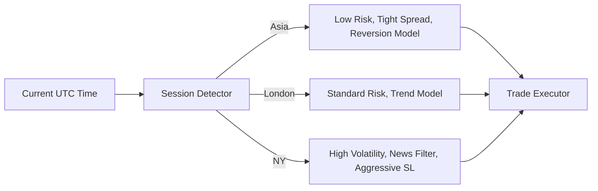

# Multi-Session Adaptive Strategy (MSAS)
**Market Session Logic & Optimization Blueprint**
**Version:** 1.0.0
**Focus:** Time-Based Liquidity & Volatility Management

---

## 1. Konsep Dasar Sesi
Bot akan menggunakan waktu **UTC** sebagai referensi utama (standar industri) dan mengonversinya secara internal untuk menyesuaikan dengan sesi pasar global.

| Sesi | Jam (WIB) | Karakteristik | Strategi Bot |
| :--- | :--- | :--- | :--- |
| **Asia (Tokyo)** | 06:00 - 15:00 | Low Volatility, Ranging | Scalping Mean-Reversion, Tight Spread Filter |
| **Europe (London)** | 14:00 - 23:00 | High Liquidity, Trending | Trend Following, Breakout Strategy |
| **US (New York)** | 19:00 - 04:00 | High Volatility, Aggressive | News-Aware Trading, Trailing SL Aktif |
| **Overlap (LDN/NY)** | 19:00 - 23:00 | **Golden Hour** | High Confidence Execution, Max Position Allowed |

---

## 2. Arsitektur Logic Sesi
Sistem akan mendeteksi sesi saat ini dan menyuntikkan (*inject*) parameter yang berbeda ke dalam modul Risk & Execution.

---

## 3. Implementasi Teknis (Plan)

### A. Dynamic Spread Filter
Spread di sesi Asia biasanya lebih lebar.
- **Asia:** Max Spread 1.5 Pips.
- **London/NY:** Max Spread 2.5 Pips (karena volatilitas lebih tinggi, spread lebar dikit masih oke).

### B. Session-Specific Risk
- **Sesi London:** Izinkan maksimal 3 posisi simultan (karena tren kuat).
- **Sesi NY:** Gunakan *Trailing Stop* lebih ketat untuk mengunci profit dari lonjakan harga tiba-tiba.

### C. Auto-Switching Model (Integrasi AutoML)
Jika kita sudah punya model ML:
- **Model A (Stable):** Aktif saat sesi Asia.
- **Model B (Aggressive):** Aktif saat sesi London/NY.

---

## 4. Keuntungan Bagi User
1.  **Proteksi Akun:** Bot otomatis berhenti atau "mengerem" di jam-jam yang tidak menguntungkan bagi strategi scalping.
2.  **Efisiensi Margin:** Fokus menggunakan margin hanya di jam-jam "Golden Hour" di mana probabilitas profit paling tinggi.
3.  **Real-Time Awareness:** User bisa cek via `/status` sesi apa yang sedang aktif dan bagaimana bot meresponnya.

---

## 5. Rencana Perubahan Kode

### `core/risk/session_manager.py` (New File)
Membuat class yang menghitung session berdasarkan jam UTC saat ini.

### `core/risk/spread_filter.py` (Update)
Menyesuaikan ambang batas spread berdasarkan output dari `SessionManager`.

### `telegram_interface/bot_handlers.py` (Update)
Menambahkan informasi sesi di laporan `/status`.

---

**Konklusi:** Dengan memahami "nafas" market melalui jam-jam sesi ini, bot tidak akan lagi trading secara buta 24 jam penuh, melainkan hanya berburu saat peluang paling optimal muncul.

**Simpan sebagai:** `SESSION_STRATEGY.md`
